<div align="center">
  
</div>

# 💊 Pharmaceutical Manufacturing Agent System – MVP 1.0

> An AI-driven **GMP-compliant** decision support system for pharmaceutical manufacturing operations

[](https://opensource.org/licenses/MIT)
[](https://nodejs.org/)
[](https://www.fda.gov/drugs/pharmaceutical-quality-resources/current-good-manufacturing-practice-cgmp-regulations)

This system integrates **Claude AI** with pharmaceutical manufacturing operations, providing intelligent decision support while maintaining full **21 CFR Part 11** and **ALCOA+** compliance for regulated environments.

## 📋 Table of Contents

- [Features](#-features)
- [System Architecture](#-system-architecture)
- [Quick Start](#-quick-start)
- [Installation](#-installation)
- [API Reference](#-api-reference)
- [Usage Examples](#-usage-examples)
- [Compliance & Validation](#-compliance--validation)
- [Contributing](#-contributing)
- [License](#-license)

---

## 🚀 Features

### Core Functionality
- **🤖 Claude AI Integration** - Natural language processing for manufacturing commands
- **📊 Intelligent Decision Support** - Real-time analysis of production data
- **📅 Daily Operations Briefings** - Automated morning briefings and shift handovers
- **🔍 Quality Assurance Tools** - Batch release recommendations and deviation analysis

### Compliance & Security
- **📋 21 CFR Part 11 Compliance** - Electronic records and signatures
- **🔒 ALCOA+ Data Integrity** - Attributable, Legible, Contemporaneous, Original, Accurate
- **📝 Complete Audit Trail** - Every AI interaction logged and traceable
- **🛡️ Data Validation** - Input validation and sanitization

### Technical Features
- **⚡ Real-time Processing** - Async operations with loading indicators
- **🎨 Professional UI** - McKinsey-style interface design
- **📱 Responsive Design** - Works on desktop, tablet, and mobile
- **🏥 Health Monitoring** - System health checks and monitoring endpoints

---

## 🏗️ System Architecture

```mermaid
flowchart TD
    U[👤 User] -->|HTTPS| F[🌐 Frontend]
    F -->|REST API| B[⚙️ Backend Server]
    
    B --> C[🤖 Claude AI]
    B --> M[📄 Mock Data Store]
    B --> A[📋 Audit System]
    
    subgraph "🔒 GMP Compliance Layer"
        A --> AL[Audit Log]
        A --> AV[Audit Viewer]
        B --> AM[Audit Middleware]
    end
    
    subgraph "📊 Data Sources"
        M --> O[Orders]
        M --> I[Issues]
        M --> BR[Briefings]
    end
    
    style U fill:#e1f5fe
    style C fill:#f3e5f5
    style A fill:#e8f5e8
```



### 📁 Project Structure

```
agent-framework/
├── 🌐 public/                 # Frontend assets
│   ├── index.html            # Main application interface
│   ├── audit.html            # GMP audit log viewer
│   ├── css/
│   │   └── styles.css        # McKinsey-style UI components
│   └── js/
│       └── app.js            # Frontend application logic
├── 📊 mock-data/             # Manufacturing data simulation
│   ├── orders.json           # Production orders
│   ├── issues.json           # Quality issues & deviations
│   └── morning_briefing.json # Daily operations data
├── ⚙️ config/                # System configuration
│   └── agents.json           # AI agent definitions
├── 📋 audit_log.json         # Compliance audit trail
├── 🚀 app.js                 # Express server & API routes
├── 📦 package.json           # Dependencies & scripts
└── 📖 README.md              # This documentation
```

---

## ⚡ Quick Start

```bash
# Clone and setup
git clone https://github.com/YOUR_USERNAME/pharma-agent-mvp.git
cd pharma-agent-mvp/agent-framework

# Install dependencies
npm install

# Configure environment
echo "CLAUDE_API_KEY=your_api_key_here" > .env

# Start the system
npm start

# Open in browser
open http://localhost:4000
```

---

## 🛠️ Installation

### Prerequisites

- **Node.js** ≥ 16.0.0
- **npm** ≥ 8.0.0
- **Claude API Key** from [Anthropic Console](https://console.anthropic.com/)

### Step-by-Step Setup

1. **Clone the Repository**
   ```bash
   git clone https://github.com/YOUR_USERNAME/pharma-agent-mvp.git
   cd pharma-agent-mvp/agent-framework
   ```

2. **Install Dependencies**
   ```bash
   npm install
   ```

3. **Environment Configuration**
   
   Create a `.env` file in the root directory:
   ```env
   # Server Configuration
   PORT=4000
   NODE_ENV=development
   
   # Claude AI Configuration
   CLAUDE_API_KEY=your_anthropic_api_key_here
   CLAUDE_MODEL=claude-3-5-sonnet-20241022
   
   # Audit Configuration
   AUDIT_ENABLED=true
   AUDIT_RETENTION_DAYS=2555  # 7 years for GMP compliance
   ```

4. **Start the Application**
   ```bash
   # Development mode
   npm run dev
   
   # Production mode
   npm start
   ```

5. **Verify Installation**
   
   Open [http://localhost:4000/health](http://localhost:4000/health) to check system status.

---

## 🔌 API Reference

### Core Endpoints

| Method | Endpoint | Description | Response |
|--------|----------|-------------|----------|
| `GET` | `/health` | System health check | `200 OK` |
| `POST` | `/chat` | Process manufacturing command | Agent response |
| `GET` | `/audit_log.json` | Raw audit trail data | JSON audit log |
| `GET` | `/audit.html` | Web-based audit viewer | HTML interface |

### Chat API

**Endpoint:** `POST /chat`

**Request Body:**
```json
{
  "message": "string",
  "user_id": "string (optional)",
  "session_id": "string (optional)"
}
```

**Response:**
```json
{
  "response": "AI agent response",
  "timestamp": "2025-01-20T10:30:00Z",
  "audit_id": "unique_audit_identifier",
  "processing_time_ms": 1250
}
```

---

## 🧪 Usage Examples

### Predefined Operations

| Command | Description | Example Output |
|---------|-------------|----------------|
| `ask-today-orders` | Show today's open production orders | List of pending orders with priorities |
| `general-assessment` | 24-hour production release assessment | Release recommendations with risk factors |
| `morning-briefing` | Daily operations overview | Shift handover summary with KPIs |
| `schedule-line` | Production line scheduling | Available slots and resource allocation |
| `qa-review` | Quality assurance status | Batch review status and pending decisions |

### Natural Language Queries

```bash
# Quality queries
"Which batches are ready for release?"
"Show me any critical deviations from last week"
"What's the status of Batch #2024-001?"

# Production queries
"How many units of Product X can we produce today?"
"Are there any equipment issues affecting Line 3?"
"What's our OEE for this month?"

# Supply chain queries
"Do we have enough raw materials for next week?"
"Which suppliers have pending quality approvals?"
```

### Integration Examples

**cURL Example:**
```bash
curl -X POST http://localhost:4000/chat \
  -H "Content-Type: application/json" \
  -d '{
    "message": "Show me critical issues requiring attention",
    "user_id": "john.smith@pharma.com"
  }'
```

**JavaScript Example:**
```javascript
const response = await fetch('/chat', {
  method: 'POST',
  headers: { 'Content-Type': 'application/json' },
  body: JSON.stringify({
    message: 'morning-briefing',
    user_id: 'production.manager@pharma.com'
  })
});

const data = await response.json();
console.log(data.response);
```

---

## ✅ Compliance & Validation

### 21 CFR Part 11 Requirements

- **✓ Electronic Records** - All AI interactions are electronically recorded
- **✓ Electronic Signatures** - User identification in audit trail
- **✓ System Validation** - Documented testing and validation procedures
- **✓ Audit Trail** - Complete, tamper-evident audit trail
- **✓ System Access** - User authentication and authorization controls

### ALCOA+ Data Integrity

| Principle | Implementation |
|-----------|----------------|
| **Attributable** | User ID logged with every action |
| **Legible** | Human-readable audit trail format |
| **Contemporaneous** | Real-time timestamp logging |
| **Original** | Immutable audit log entries |
| **Accurate** | Input validation and error handling |
| **Complete** | Full context captured in logs |
| **Consistent** | Standardized data formats |
| **Enduring** | Long-term data retention (7+ years) |
| **Available** | Accessible audit viewer interface |

### Audit Trail Example

```json
{
  "audit_id": "aud_20250120_103045_001",
  "timestamp": "2025-01-20T10:30:45.123Z",
  "user_id": "john.smith@pharma.com",
  "action": "manufacturing_query",
  "input": "Show me today's critical batches",
  "response": "Found 3 critical batches requiring attention...",
  "processing_time_ms": 1247,
  "system_info": {
    "claude_model": "claude-3-5-sonnet-20241022",
    "version": "1.0.0"
  }
}
```

---

## 🚀 Development & Contributing

### Development Setup

```bash
# Install development dependencies
npm install --include=dev

# Run tests
npm test

# Run linting
npm run lint

# Start with hot reload
npm run dev
```

### Testing

```bash
# Run unit tests
npm run test:unit

# Run integration tests
npm run test:integration

# Run compliance tests
npm run test:compliance
```

### Contributing Guidelines

1. **Fork** the repository
2. **Create** a feature branch (`git checkout -b feature/amazing-feature`)
3. **Commit** your changes (`git commit -m 'Add amazing feature'`)
4. **Push** to the branch (`git push origin feature/amazing-feature`)
5. **Open** a Pull Request

---

## 🔧 Configuration

### Environment Variables

| Variable | Description | Default | Required |
|----------|-------------|---------|----------|
| `PORT` | Server port | `4000` | No |
| `CLAUDE_API_KEY` | Anthropic API key | - | Yes |
| `CLAUDE_MODEL` | Claude model version | `claude-3-5-sonnet-20241022` | No |
| `AUDIT_ENABLED` | Enable audit logging | `true` | No |
| `AUDIT_RETENTION_DAYS` | Audit log retention | `2555` | No |

### Agent Configuration

Customize AI agents in `config/agents.json`:

```json
{
  "manufacturing_agent": {
    "role": "Manufacturing Operations Specialist",
    "expertise": ["GMP", "batch_processing", "quality_control"],
    "response_style": "professional",
    "max_tokens": 2000
  }
}
```

---

## 🔍 Troubleshooting

### Common Issues

**🚨 Claude API Key Error**
```
Error: Missing or invalid Claude API key
```
Solution: Verify your `.env` file contains a valid `CLAUDE_API_KEY`

**🚨 Port Already in Use**
```
Error: Port 4000 is already in use
```
Solution: Change the `PORT` in your `.env` file or kill the process using the port

**🚨 Audit Log Permissions**
```
Error: Cannot write to audit_log.json
```
Solution: Ensure the application has write permissions to the project directory

### Performance Optimization

- **Enable caching** for frequently accessed data
- **Implement connection pooling** for database connections
- **Use compression** for API responses
- **Optimize Claude API calls** with request batching

---

## 📊 Monitoring & Analytics

### Health Check Endpoint

The `/health` endpoint provides comprehensive system status:

```json
{
  "status": "healthy",
  "timestamp": "2025-01-20T10:30:00Z",
  "uptime": 86400,
  "version": "1.0.0",
  "components": {
    "claude_api": "connected",
    "audit_system": "active",
    "data_store": "accessible"
  }
}
```

### System Metrics

Monitor key performance indicators:
- **Response Time** - Average API response time
- **Audit Log Size** - Growing audit trail
- **Error Rate** - Failed requests ratio
- **User Activity** - Active users and sessions

---

## 🔐 Security Considerations

### Data Protection
- All sensitive data should be encrypted in transit and at rest
- Implement proper input validation and sanitization
- Use secure session management
- Regular security audits and penetration testing

### Access Control
- Implement role-based access control (RBAC)
- Use strong authentication mechanisms
- Monitor and log all access attempts
- Regular access reviews and cleanup

---

## 🗺️ Roadmap

### Version 1.1 - Enhanced Compliance
- [ ] Digital signature integration
- [ ] Advanced user authentication
- [ ] Role-based permissions
- [ ] Enhanced audit capabilities

### Version 1.2 - Production Integration
- [ ] MES system integration
- [ ] LIMS connectivity
- [ ] Real-time data feeds
- [ ] Advanced analytics dashboard

### Version 2.0 - Enterprise Scale
- [ ] Multi-site deployment
- [ ] Advanced AI models
- [ ] Predictive analytics
- [ ] Mobile application

---

## 📞 Support & Contact

- **Documentation**: [Wiki](https://github.com/YOUR_USERNAME/pharma-agent-mvp/wiki)
- **Issues**: [GitHub Issues](https://github.com/YOUR_USERNAME/pharma-agent-mvp/issues)
- **Discussions**: [GitHub Discussions](https://github.com/YOUR_USERNAME/pharma-agent-mvp/discussions)
- **Email**: support@pharma-agent-mvp.com

---

## 📜 License

MIT License © 2025 Pharmaceutical Manufacturing Agent MVP Project

```
Permission is hereby granted, free of charge, to any person obtaining a copy
of this software and associated documentation files (the "Software"), to deal
in the Software without restriction, including without limitation the rights
to use, copy, modify, merge, publish, distribute, sublicense, and/or sell
copies of the Software, and to permit persons to whom the Software is
furnished to do so, subject to the following conditions:

The above copyright notice and this permission notice shall be included in all
copies or substantial portions of the Software.
```

---

## 🙏 Acknowledgments

- [Anthropic](https://anthropic.com) for Claude AI API
- [FDA](https://www.fda.gov) for GMP guidelines and 21 CFR Part 11
- [ISPE](https://ispe.org) for pharmaceutical manufacturing best practices
- Open source community for various dependencies and tools

---

**⚠️ Disclaimer:** This is a prototype system for demonstration purposes. For production use in regulated pharmaceutical environments, additional validation, testing, and compliance verification are required.